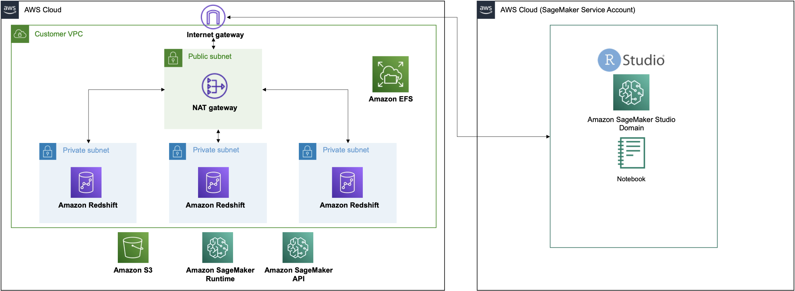
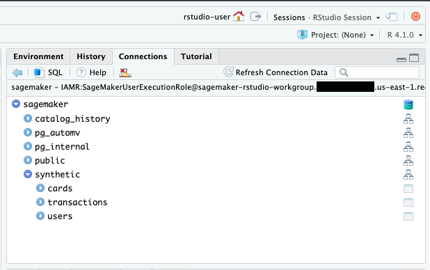
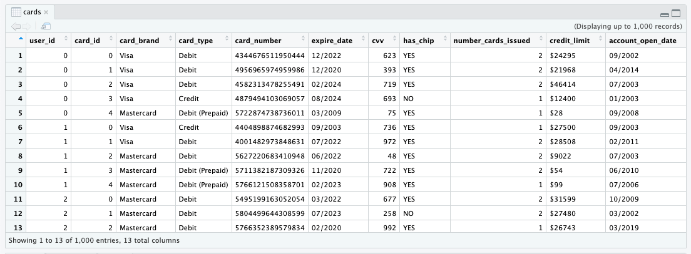
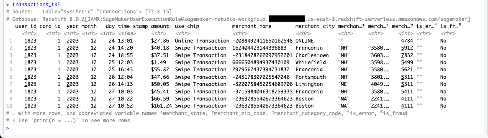

# Connect Amazon SageMaker RStudio to Redshift Serverless
This blog post describes how to connect Amazon SageMaker RStudio to Redshift Serverless. With this setup we can run analytics at scale from SageMaker RStudio without having to manage a data warehouse. 

## Architecture



## Launching AWS CloudFormation
Please refer to [Get started with RStudio on Amazon SageMaker](https://aws.amazon.com/blogs/machine-learning/get-started-with-rstudio-on-amazon-sagemaker/) which describes the steps to create a SageMaker domain with RStudio. Use the following AWS CloudFormation stack to create the infrastructure needed to connect SageMaker RStudio to a Redshift Serverless database:

[Launch Stack Button](https://console.aws.amazon.com/cloudformation/home?region=us-east-1#/stacks/new?stackName=sagemaker-rstudio-redshift-serverless&templateURL=https://aws-blogs-artifacts-public.s3.amazonaws.com/artifacts/ML-12071/sagemaker-rstudio-template.yaml)

Launching this stack creates the following resources:

- 3 Private subnets
- 1 Public subnet
- 1 NAT Gateway
- Internet Gateway
- Redshift Serverless cluster
- SageMaker domain with RStudio
- SageMaker RStudio user profile
- IAM service role for SageMaker RStudio domain execution
- IAM service role for SageMaker RStudio user profile execution

1. On the Create stack page, choose Next.
2. On the Specify stack details page, provide a name for your stack, and leave the remaining options as default, then choose Next.
3. On the Configure stack options page, leave the options as default and press Next. 
4. On the Review page, select the **I acknowledge that AWS CloudFormation might create IAM resources with custom names** and **I acknowledge that AWS CloudFormation might require the following capability: CAPABILITY_AUTO_EXPAND** check boxes and choose Create stack.

Once the stack status is **CREATE_COMPLETE**, navigate to the Amazon Redshift Serverless dashboard and click [Query data](https://docs.aws.amazon.com/redshift/latest/mgmt/query-editor-v2-using.html). The CloudFormation script created a database called `sagemaker`. We will populate this database with tables for the RStudio user to query. Create a SQL editor tab and make sure the `sagemaker` database is selected. We will be using the [synthetic credit card transaction data](https://www.kaggle.com/datasets/ealtman2019/credit-card-transactions) to create tables in our database. This data is part of the SageMaker sample tabular datasets, `s3://sagemaker-sample-files/datasets/tabular/synthetic_credit_card_transactions`. 

> NOTE: We had to use `VARCHAR(100)` quite extensively to prevent data loading errors.

```
CREATE SCHEMA IF NOT EXISTS synthetic;
DROP TABLE IF EXISTS synthetic.transactions;

CREATE TABLE synthetic.transactions(
    user_id INT,
    card_id INT,
    year INT,
    month INT,
    day INT,
    time_stamp TIME,
    amount VARCHAR(100),
    use_chip VARCHAR(100),
    merchant_name VARCHAR(100),
    merchant_city VARCHAR(100),
    merchant_state VARCHAR(100),
    merchant_zip_code VARCHAR(100),
    merchant_category_code INT,
    is_error VARCHAR(100),
    is_fraud VARCHAR(100)
);

COPY synthetic.transactions
FROM 's3://sagemaker-sample-files/datasets/tabular/synthetic_credit_card_transactions/credit_card_transactions-ibm_v2.csv'
IAM_ROLE default
REGION 'us-east-1' 
IGNOREHEADER 1 
CSV;

DROP TABLE IF EXISTS synthetic.cards;

CREATE TABLE synthetic.cards(
    user_id INT,
    card_id INT,
    card_brand VARCHAR(100),
    card_type VARCHAR(100),
    card_number VARCHAR(100),
    expire_date VARCHAR(100),
    cvv INT,
    has_chip VARCHAR(100),
    number_cards_issued INT,
    credit_limit VARCHAR(100),
    account_open_date VARCHAR(100),
    year_pin_last_changed VARCHAR(100),
    is_card_on_dark_web VARCHAR(100)
);

COPY synthetic.cards
FROM 's3://sagemaker-sample-files/datasets/tabular/synthetic_credit_card_transactions/sd254_cards.csv'
IAM_ROLE default
REGION 'us-east-1' 
IGNOREHEADER 1 
CSV;

DROP TABLE IF EXISTS synthetic.users;

CREATE TABLE synthetic.users(
    name VARCHAR(100),
    current_age INT,
    retirement_age INT,
    birth_year INT,
    birth_month INT,
    gender VARCHAR(100),
    address VARCHAR(100),
    apartment VARCHAR(100),
    city VARCHAR(100),
    state VARCHAR(100),
    zip_code INT,
    lattitude VARCHAR(100),
    longitude VARCHAR(100),
    per_capita_income_zip_code VARCHAR(100),
    yearly_income VARCHAR(100),
    total_debt VARCHAR(100),
    fico_score INT,
    number_credit_cards INT
);

COPY synthetic.users
FROM 's3://sagemaker-sample-files/datasets/tabular/synthetic_credit_card_transactions/sd254_users.csv'
IAM_ROLE default
REGION 'us-east-1' 
IGNOREHEADER 1 
CSV;
```

Once all of the tables are populated, navigate to SageMaker RStudio and start a new session with RSession Base image on a `ml.m5.xlarge` instance. Once the session is launched, we will run this code to create a connection to our Redshift Serverless database.
```
library(DBI)
library(reticulate)
path_to_python <- system("which python", intern = TRUE)
use_python(path_to_python)
boto3 <- import('boto3')
client <- boto3$client('redshift-serverless')
workgroup <- unlist(client$list_workgroups())
namespace <- unlist(client$get_namespace(namespaceName=workgroup$workgroups.namespaceName))
creds <- client$get_credentials(dbName=namespace$namespace.dbName,
                                durationSeconds=3600L,
                                workgroupName=workgroup$workgroups.workgroupName)
con <- dbConnect(odbc::odbc(),
                 Driver='redshift',
                 Server=workgroup$workgroups.endpoint.address,
                 Port='5439',
                 Database=namespace$namespace.dbName,
                 UID=creds$dbUser,
                 PWD=creds$dbPassword)
```
In order to view the tables in the `synthetic` schema, you will need to grant access in Redshift via the query editor.

```
GRANT ALL ON SCHEMA synthetic to "IAMR:SageMakerUserExecutionRole";
GRANT ALL ON ALL TABLES IN SCHEMA synthetic to "IAMR:SageMakerUserExecutionRole";
```

The RStudio Connections pane should show the `sagemaker` database with schema `synthetic` and tables `cards`, `transactions`, `users`.



You can click the table icon next to the tables to view 1,000 records.



Now we will use the `DBI` package function `dbListTables()` to view existing tables.
```{r}
dbListTables(con)
```

Use `dbGetQuery()` to pass an SQL query to the database.
```{r}
dbGetQuery(con, "select * from synthetic.users limit 100")
dbGetQuery(con, "select * from synthetic.cards limit 100")
dbGetQuery(con, "select * from synthetic.transactions limit 100")
```

We can also the `dbplyr` and `dplyr` packages to execute queries in the database. Let's `count()` how many transactions are in the transactions table. But first we need to install these packages.
```{r}
install.packages(c("dplyr", "dbplyr", "crayon"))
```

Use the `tbl()` function while specifying the schema.
```{r}
library(dplyr)
library(dbplyr)

users_tbl <- tbl(con, in_schema("synthetic", "users"))
cards_tbl <- tbl(con, in_schema("synthetic", "cards"))
transactions_tbl <- tbl(con, in_schema("synthetic", "transactions"))
```

Let's run a count of the number of rows for each table.
```{r}
count(users_tbl)
count(cards_tbl)
count(transactions_tbl)
```

So we have 2,000 users, 6,146 cards, and 24,386,900 transactions. We can also view the tables in the console.
```{r}
transactions_tbl
```


We can also view what `dplyr` verbs are doing under the hood.
```{r}
show_query(transactions_tbl)
```

Let's visually explore the number of transactions by year.
```{r}
transactions_by_year <- transactions_tbl %>%
  count(year) %>%
  arrange(year) %>%
  collect()

transactions_by_year
```

```{r}
install.packages(c('ggplot2', 'vctrs'))
```

```{r}
library(ggplot2)
ggplot(transactions_by_year) +
  geom_col(aes(year, as.integer(n))) +
  ylab('transactions') 
```

We can also summarize data in the database as follows:
```
transactions_tbl %>%
  group_by(is_fraud) %>%
  count()
```

```
transactions_tbl %>%
  group_by(merchant_category_code, is_fraud) %>%
  count() %>% 
  arrange(merchant_category_code)
```

Suppose we want to view fraud using card information. We just need to join the tables and then group by the attribute.
```
cards_tbl %>%
  left_join(transactions_tbl, by = c("user_id", "card_id")) %>%
  group_by(card_brand, card_type, is_fraud) %>%
  count() %>% 
  arrange(card_brand)
```

Now let's prepare a dataset that could be used for machine learning. Let's filter the transaction data to just include Discover credit cards while only keeping a subset of columns.

```
discover_tbl <- cards_tbl %>%
  filter(card_brand == 'Discover', card_type == 'Credit') %>%
  left_join(transactions_tbl, by = c("user_id", "card_id")) %>%
  select(user_id, is_fraud, merchant_category_code, use_chip, year, month, day, time_stamp, amount)
```

We will clean the dataset using the following transformations:
- Convert `is_fraud` to binary attribute.
- Remove `transaction` string from `use_chip` and rename it to `type`.
- Combine `year`, `month`, and `day` into a data object.
- Remove `$` from `amount` and convert to a numeric data type.

```
discover_tbl <- discover_tbl %>%
  mutate(is_fraud = ifelse(is_fraud == 'Yes', 1, 0),
         type = str_remove(use_chip, 'Transaction'),
         type = str_trim(type),
         type = tolower(type),
         date = paste(year, month, day, sep = '-'),
         date = as.Date(date),
         amount = str_remove(amount, '[$]'),
         amount = as.numeric(amount)) %>%
  select(-use_chip, -year, -month, -day)
```

Now that we have filtered and cleaned our dataset, we are ready to `collect` this dataset into local RAM.

```
discover <- collect(discover_tbl)
summary(discover)
```

Now we have a working dataset to start creating features and fitting models. We will not cover those steps in this blog as we want to highlight how to work with database tables in Redshift to prepare a dataset to bring into our local environment.
